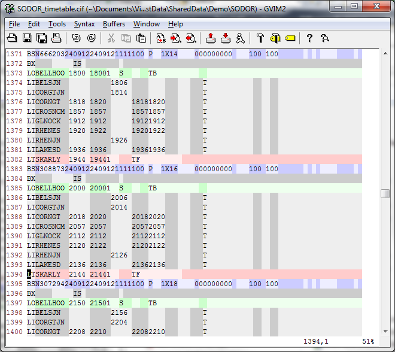

# CIF Syntax File For vim/gvim

A vim/gvim syntax highlighting for CIF timetable files.

## Installation

Copy the `syntax`, `ftdetect` and `ftplugin` folders to `$HOME/.vim` (on unix-like systems) or `$HOME\vimfiles` on Windows.

## Commands

* `<leader>ca` shows the interpretation of the activity codes on the current line

# AOB

For further information on the CIF file format, see [ATOC's spec](http://www.atoc.org/clientfiles/File/RSPS5004%20v27.pdf).

Thanks to [Tracsis plc](http://www.tracsis.com/) for allowing me to share this with you.

