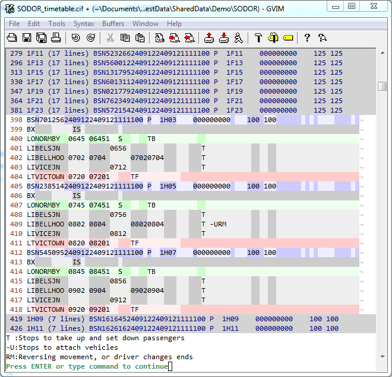

CIF Syntax File For gVim
==============

A gvim syntax highlighting for CIF timetable files.

For further information on the CIF file format, see [ATOC's spec](http://www.atoc.org/clientfiles/File/RSPS5004%20v27.pdf).

Thanks to [Tracsis plc](http://www.tracsis.com/) for allowing me to share this with you.

